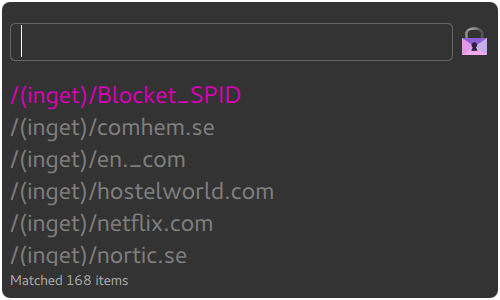

## Simple UI for password-store

This is a simple read-only UI for searching the passwords in your http://www.passwordstore.org/ password store. 

VIM keybindings are supported for selecting an entry (Ctrl-J, Ctrl-K).

## Install
If you have go installed:
`go get github.com/cortex/gopass` 

Pre-built binaries coming soon.

This might work on OSX, but I haven't tried building it. 

Pull requests are very welcome!

Licence: GPLv3
