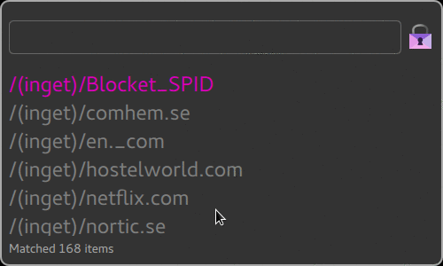

## Simple UI for password-store

This is a very simple read-only UI for searching the passwords in your http://www.passwordstore.org/ password store. It is written in Go.

I wrote it because I wanted something with a simpler UI than [QTPass](https://qtpass.org/), and the C++ code made me scared. This does only what I want with a fraction of the lines of code. It also has pretty colors!

Decryption is handled by [GPGME](https://www.gnupg.org/%28es%29/related_software/gpgme/index.html), so hopefully whatever gpg agent you are running should just work.

## Usage
Type in the search box to find the password you want. Hit enter to put it in the clipboard. Currently, you can only copy the first line in the file (which is where you probably have your password).

VIM keybindings are supported for selecting an entry (Ctrl-J, Ctrl-K).
Ctrl-L selects the search box.

## Install
If you have go installed:
`go get github.com/cortex/gopass` 

Pre-built binaries coming soon.

This might work on OSX, but I haven't tried building it. 

Pull requests are very welcome!

Licence: GPLv3
